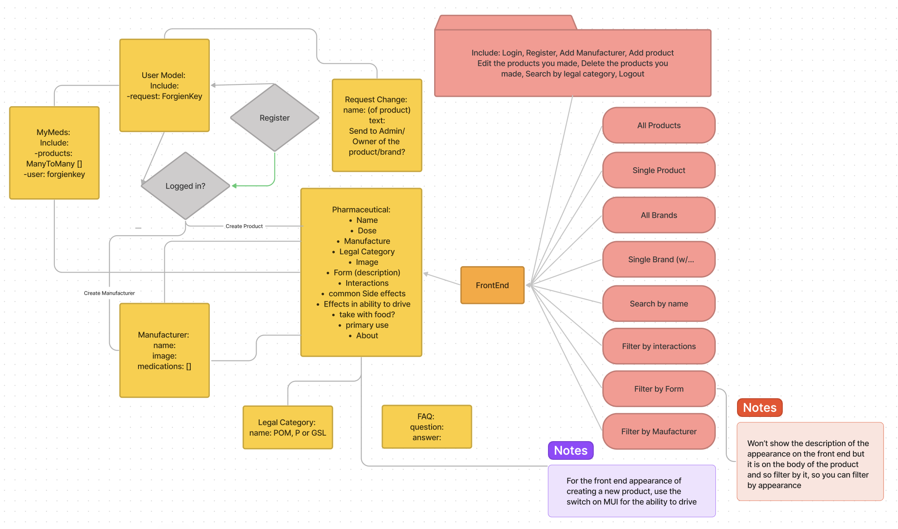
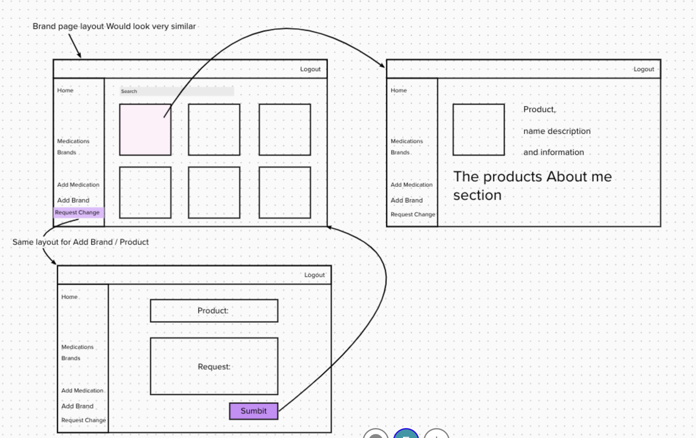

# Description

This was the fourth project in the General Assembly Software Engineering Immersive. For this project I had one week to create a full stack app. We had the choice to go solo or in a group, and I chose to try on my own. I wanted to push myself and see what I could do after three months of learning, and I had only done one project on my own in the past. The project had a Django back-end, using Postgres, and the front-end was a React.js app. I decided to go for a passion of mine, medical tech - and create a medical information and tracker website.

# Deployment link

https://medichecker.netlify.app

You can log in with the credentials:

- Username: Test
- Password: Password!1

# Getting Started/Code Installation

Copy the SSH key and run: git clone _SSH key_ in your terminal.
Use

```js
 code .
```

to open the code in VS. You will need to have python installed on your machine.
Run the commands:

```py
pipenv shell
```

```py
pipenv install
```

```py
python manage.py runserver
```

Into the back-end to get it started.

For the front-end simply run:

```js
npm install
```

```js
npm start
```

# Timeframe & Working Team (Solo/Pair/Group)

For this project I was solo, and we had the time frame of one week.

# Technologies Used

Backend: Django, pip, pipenv, python, postgres
Frontend: React.js, scss, npm, JavaScript
Version control: Git, GitHub
Planning: Figma, Mural

# Brief

Technical requirements:
You must:

- Build a full-stack application by making your own backend and your own front-end
- Use a Python Django API using Django REST Framework to serve your data from a Postgres database
- Consume your API with a separate front-end built with React
- Be a complete product which most likely means multiple relationships and CRUD functionality for at least a couple of models
- Implement thoughtful user stories/wireframes that are significant enough to help you know which features are core MVP and which you can cut
- Be deployed online so it's publicly accessible.

# Planning

As I chose to do this project alone I had to plan in detail in order to make sure I didn’t waste time further down the line. I started by thinking about what website would be good to make, a mix between something I am interested in and something which would be challenging but achievable. Due to my past work I am fascinated by pharmaceuticals. I find the way they work in the body amazing and how most people don’t know enough about them (including me!). So I decided to make MediChecker, a user-friendly website where people can go to look up their medications and check any interactions or if the side effects they’re getting are normal. I think this is a good place to make clear I am not a pharmacist or a doctor, and therefore ALL the medications on the website have been completely made up by me to seed the database.

## Firstly:

I made a flow diagram to see how everything was going to fit together, for this I used figma:



I had decided to make one central model, and have the users be able to add products and brands, with the products and brands feeding into each other. The legal category is a model of its own, mainly as there are only three legal categories of drugs, P (pharmacy), POM (prescription only medicines) and GSL (general sales list). So to ensure the final website would look uniform I added a model so people could choose the relevant option. I also made a request section. As only the ‘owner’ of a product can change the information, and let's face it - we all make mistakes, the requests are there to request a change on any of the medications you can see. This will go to the admin who is a superuser and so can make edits on everything.

## Secondly:

I did a wireframe of the frontend so I went in with a clear idea of what I was going to set out to produce by the end of one week.



# Build/Code Process

I started by creating the project in the back-end, then creating a superuser and beginning on the separate apps. I started with the user model, and I created a login and register view:

```py
class RegisterView(APIView):
def post(self, request):
user_to_create = UserSerializer(data=request.data)
if user_to_create.is_valid():
user_to_create.save()
return Response({'message': 'Registration complete'}, status=status.HTTP_201_CREATED)
return Response(user_to_create.errors, status=status.HTTP_422_UNPROCESSABLE_ENTITY)

class LoginView(APIView):
    def post(self, request):
        username = request.data.get('username')
        password = request.data.get('password')
    try:
        user_to_login = User.objects.get(username=username)
    except User.DoesNotExist:
        raise PermissionDenied(detail="Invalid Credentials")
    if not user_to_login.check_password(password):
        raise PermissionDenied(detail="Invalid Credentials")

        dt = datetime.now() + timedelta(days=7)


        token = jwt.encode(
            {'sub': user_to_login.id, 'exp': int(dt.strftime('%s')), 'is_staff': user_to_login.is_staff },
            settings.SECRET_KEY,
            algorithm ='HS256'
        )
        return Response({'token': token, 'message': f"Welcome back {user_to_login.username}!"})
```

These allowed me to make a non-admin user as well, and so be able to test the routes in postman. I chose to make an app for the legal category so that I could map into a dropdown menu on the front-end when a user was creating a new product. Once I had made the majority of the apps I moved onto the biggest app I had, which was the products app. One of the keys I had on the products was linked to the User model:

```py
owner = models.ForeignKey('jwt_auth.User', related_name="products", on_delete=models.CASCADE)
```

This meant a user id would be required to create a product. This is designed so that only the owner of a product or admin can edit the product. The id is not entered by the user, but generated from the information on the token:

```py
request.data['owner'] = request.user.id
```

I knew I wanted search functionality but we hadn’t been taught it in class, however I looked into it and we have done search functionality in other languages so I decided to attempt it. I wanted to be able to search the products by name, appearance or primary use. The appearance would come from the ‘form’ key but this would never be displayed on the front-end so it would give the illusion it was coming from the photos. I did the search like this:

```py
class ProductSearch(APIView):
def get(self, request):
 query = request.GET.get('search')
 results = Products.objects.filter(Q(name__icontains=query) | Q(form__icontains=query) | Q(primary_use__icontains=query))
serialied_results = ProductSerializer(results, many=True)
return Response(serialied_results.data)
```

I made a new class as it would have a route ending with ‘search/’. I then perform a get request and filter the products by the query in the search bar. They are filtered by name, form or primary use before putting it through the serializer.

Once I created the front end app and connected the front and back end I worked on the product index first. I did an API call to ‘get’ all the products and mapped over them on an individual product card to produce a gridded page with all the products. I then used a useEffect to have a responsive search bar working in the products index:

```js
useEffect(() => {
  setProducts(filteredProducts);
}, [filteredProducts]);
```

For the seed data I had made, the drive and food values were Booleans, so in order to get them to show up in the single products page I had to convert them using into strings, I chose to do this using a small if else statement:

```js
let driveData = '';
if (singleProduct?.drive) {
  driveData = 'Yes';
} else {
  driveData = 'No';
}
```

I did this so that when it was presented on the page it didn't show “true” or “false” but “Yes” or “No” as I felt this was a better way to present the data.

When I created a product page, I decided I wanted some different ways to input the data. For project 3 I used a drag and drop, so this time for the true or false values I decided to use a switch. The switch had two options, true or false, and I simply added the two checked values to the formData and then passed it into the API request:

```js
const handleChangeOne = (e) => {
  setCheckedOne(e.target.checked);
};

const data = {
  name: formData.name,
  dose: formData.dose,
  brand: formData.brand,
  category: formData.category,
  image: formData.image,
  form: formData.form,
  interactions: formData.interactions,
  side_effects: formData.side_effects,
  drive: checkedOne,
  food: checkedTwo,
  primary_use: formData.primary_use,
  about: formData.about
};
```

I also decided to do a few drop down options so that there wouldn’t be invalid data or inconsistent data added. The categories are a backend app which is unchangeable by anyone except the superuser, and then the other dropdown is the brands. I decided to add an option which would allow you to quickly add a brand if you realised the brand was not there:

```js
<MenuItem onClick={navigateToCreateBrand}>Not There?</MenuItem>
```

If you click on this option from the dropdown you’re immediately taken to the create a brand page. From there there is a submit button which will submit the new brand and take you back to the create a product page so you can complete you initial action:

```js
const handleSubmitAndNextAdd = (e) => {
  e.preventDefault();
  API.POST(API.ENDPOINTS.getAllBrands, formData, API.getHeaders())
    .then(({ data }) => {
      console.log(data);
      navigate('/products/create');
    })
    .catch((e) => {
      if (e.status === 301) {
        setError(true);
      }
      console.log(e);
    });
};
```

I did this to help allow for a smooth and easy experience for the user.

# Challenges

I had to create a route in which only the admin could make that API call. I played around with what is returned in the user body that Django provides and decided not to create an is_admin key on the user but instead, use the is_staff key. I inputted this onto the back-end code for the admin being able to ‘get’ all the requests of change people had sent in. However, when this came to the front-end, I was not able to attach headers to my get request. I could have made a new front-end route, or I could have changed the back-end. I decided to alter the ‘def get’ to a ‘def post’:

```py
class RequestsListView(APIView):

    def post(self, request):
      is_staff = request.user.is_staff
      if not is_staff:
        raise PermissionDenied()
      requests_to_edit = Requests.objects.all()
      serialized_requests = PopulatedRequestSerializer(requests_to_edit, many=True)
      return Response(serialized_requests.data, status=status.HTTP_200_OK)
```

This meant when I was sending the requests I had to put empty object brackets in as the empty request body.

Isolating the data for the medical tracker was difficult, so in the end I populated the serializer on the user model and got the data through that route:

```js
useEffect(() => {
  API.GET(API.ENDPOINTS.medsList(userId))
    .then(({ data }) => {
      setMyMeds(data.my_meds);
      console.log(data.my_meds[0].products);
    })
    .catch(({ message, response }) => console.log(message, response));
}, [userId]);
```

# Wins

We had the choice to go solo or in a group for this project, as I have been in a group the majority of the time and as I wanted to test myself I decided to go alone. I knew it would be hard work to produce the polished product I had in my mind. I am very proud that I managed to do it on my own. I think it can be nice to work in a group but it’s a great feeling to achieve a product and know you were responsible for everything.

I am also proud of the search functionality. To be able to complete something without being directly taught has given me confidence in translating my knowledge from one language to another and investigating documentation.

# Key Learnings/Takeaways

Through all the projects it has been vital to plan your work ahead of time, but with groups the idea evolves in many ways throughout the process and you must be flexible to work with this. On a solo project the planning is essential, you cannot just muddle your way through. I am grateful I made such a detailed plan and knew exactly where I wanted to take the application next. This saved a lot of time and made the execution of each task much smoother. I feel a lot more comfortable with Python now that I have built something. The practical experience has made overall concepts much clearer for me.

# Bugs

I added a stretch goal of having a medical tracker, to keep your medications in their own list. I managed to get a favourites icon onto the product card and link it to the watchlist, however if you click the button more than once it repeatedly adds the product, and the heart icons do not stay checked if you move off the page and come back to it. To do this I would add in an if statement which checked if the product was already on the medication tracker, and if so - not add it again.

# Future Improvements

Firstly I would fix the minor bugs before adding anymore functionality. Then I would:

- Change the image URL to cloudinary images, like I did on project-3. I would also improve the responsiveness of the app.
- Add a time to the medication tracker, that way the app can send you notifications to ensure you don’t forget.
